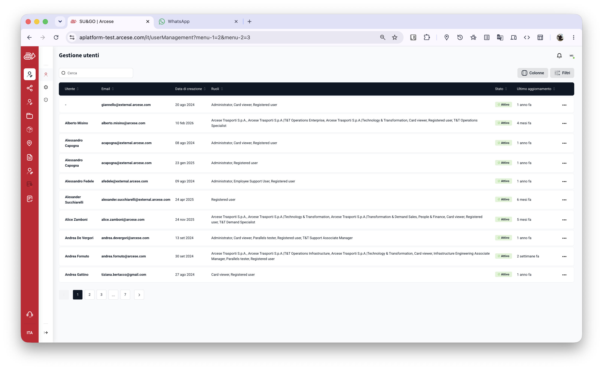
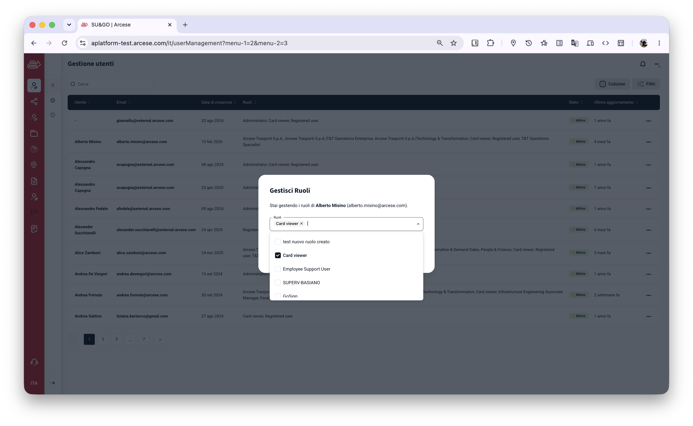
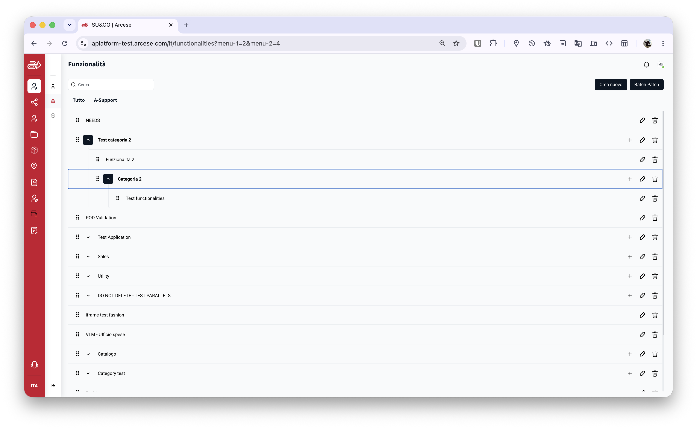
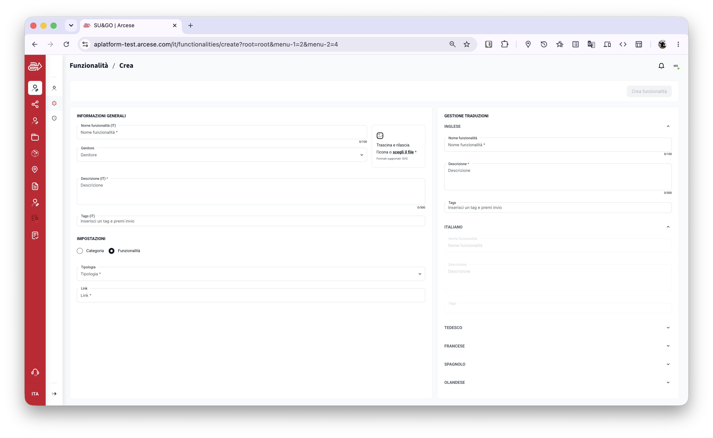
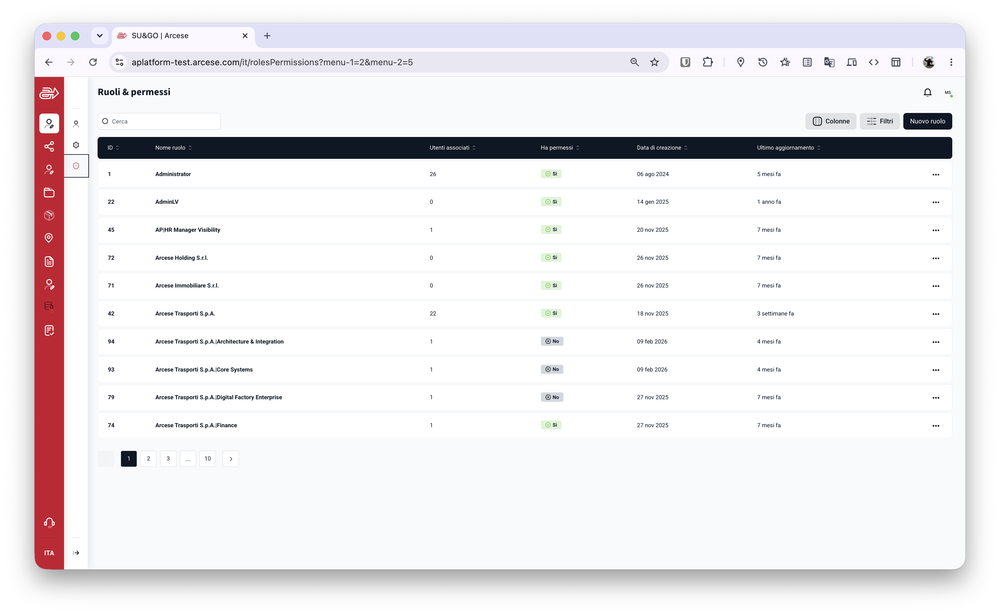
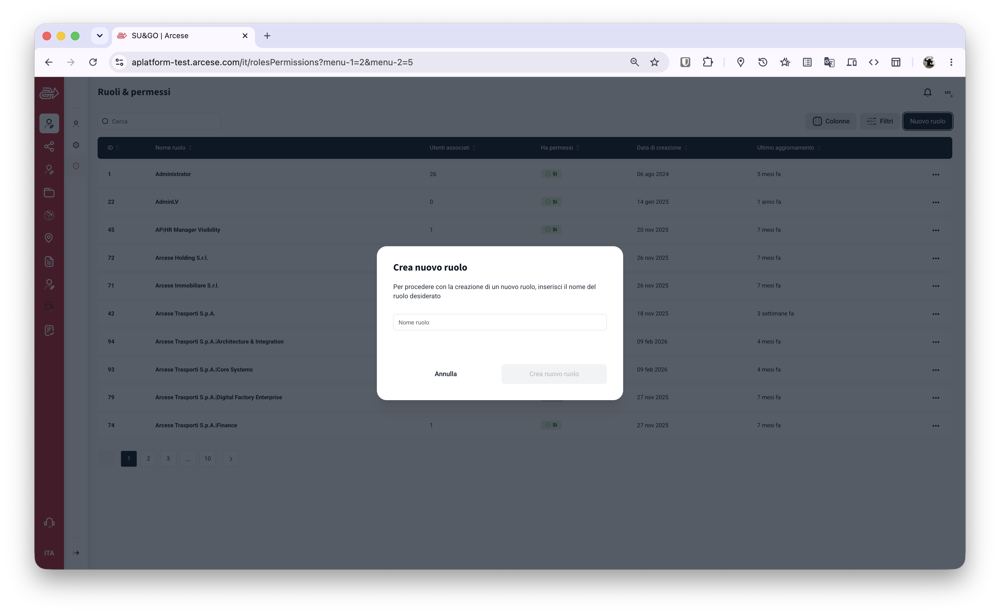
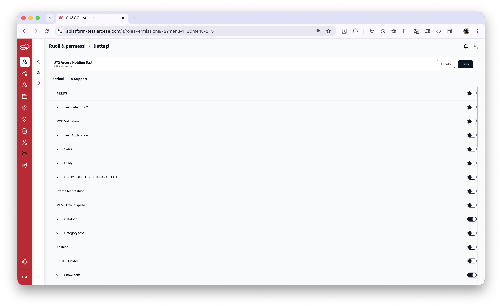

# RBAC Module — Specifiche Funzionali (Reverse Engineering)

Specifiche per la ricostruzione delle tre aree del modulo RBAC: **Utenti**, **Funzionalità** e **Ruoli & Permessi** (RBAC). Derivate per reverse engineering dal codebase originale (Java Spring Boot + Next.js) che va ora implementato qui nel construct.

Devo portare queste funzionalità dentro al programma Construct. Queste funzionalità sono state prese da un altro sistema sviluppato in passato basato su un diverso tipo di backend. Io devo portare dentro al Construct. 

Se in queste specifiche ci sono incongruenze, fai domane. 
Se in queste specifiche ci sono delle migliorie da fare, proponile. 

Una nota per la multitenancy. Non so quanto la multitenancy completa sul vecchio sistema, Credo fosse predisposto, però non utilizzata nella realtà.

Una nota per le funzionalità. In qualche modo le funzionalità erano legate anche al menu in cui venivano visualizzate. Però, questo non è una cosa generale. In realtà, le funzionalità potrebbero essere tranquillamente funzionalità da legare ai ruoli, ma che non vengono assolutamente visualizzate nei menu a sinistra della web application da nessun utente. Cerca di generalizzare questa parte.  

---

## Indice

1. [Panoramica e Stack](#1-panoramica-e-stack)
2. [Schema Database](#2-schema-database)
3. [Area: Utenti](#3-area-utenti)
4. [Area: Funzionalità](#4-area-funzionalità)
5. [Area: Ruoli & Permessi (RBAC)](#5-area-ruoli--permessi-rbac)
6. [Dati di Seed Obbligatori](#6-dati-di-seed-obbligatori)
7. [Autenticazione & Regole di Business](#7-autenticazione--regole-di-business)

---

## 1. Panoramica e Stack

| Layer | Tecnologia originale |
|---|---|
| Database | PostgreSQL — schema `iam` (nome configurabile) |
| Backend | Java 17 / Spring Boot — API REST da spec OpenAPI |
| Frontend | Next.js (pages router) + React Query + Axios + Mantine UI |
| Auth | JWT Bearer Token emesso da IDP esterno; il backend lo valida |
| i18n | react-i18next; traduzioni per funzionalità in colonna JSON `item_translation` |

**Lingue supportate:** IT, EN, DE, FR, ES, NL, PT, SK, RO

Tutte e tre le aree richiedono che l'utente chiamante abbia il ruolo **Administrator** (id=1). Il backend applica questo controllo su ogni endpoint prima di eseguire la logica.

---

## 2. Schema Database

### 2.1 Tabelle Utenti

#### `user`

| Colonna | Tipo | Vincoli | Note |
|---|---|---|---|
| `id_user` | NUMERIC | PK, DEFAULT nextval(s_id_user) | Chiave surrogata auto-incrementale |
| `sub` | VARCHAR(50) | | Subject ID dall'IDP (es. `auth0|abc123`) |
| `first_name` | VARCHAR(30) | | |
| `last_name` | VARCHAR(30) | | |
| `email` | VARCHAR(50) | | |
| `country` | VARCHAR(3) | | ISO 3166-1 alpha-3 |
| `branch` | VARCHAR(50) | | |
| `flow` | VARCHAR(10) | | |
| `uom_role` | VARCHAR(20) | | |
| `additional_company` | TEXT | | |
| `owner_company` | VARCHAR(10) | | |
| `features` | TEXT | | Feature flags dall'IDP |
| `date_ins` | TIMESTAMP | DEFAULT now(), NOT NULL | |
| `picture_url` | VARCHAR(200) | | Avatar dall'IDP |
| `date_mod` | TIMESTAMP | | |
| `id_user_status` | NUMERIC | FK → user_status, DEFAULT 2 | Default = Active |
| `last_status_ts` | TIMESTAMP | | Ultima variazione stato |

#### `user_status` (lookup)

| id_user_status | description |
|---|---|
| 1 | Deactivated |
| 2 | Active |

#### `user_role` (N:N utenti–ruoli)

| Colonna | Tipo | Vincoli |
|---|---|---|
| `id_user` | NUMERIC | PK, FK → user |
| `id_role` | NUMERIC | PK, FK → role |
| `date_ins` | TIMESTAMP | DEFAULT now(), NOT NULL |

#### `user_info` (attributi K/V estendibili per utente)

| Colonna | Tipo | Vincoli |
|---|---|---|
| `id_user` | NUMERIC | PK, FK → user |
| `attribute_type` | VARCHAR(30) | PK |
| `attribute_value` | TEXT | NOT NULL |
| `date_ins` | TIMESTAMP | DEFAULT now() |
| `date_mod` | TIMESTAMP | |

---

### 2.2 Tabelle Ruoli

#### `role`

| Colonna | Tipo | Vincoli | Note |
|---|---|---|---|
| `id_role` | NUMERIC | PK, DEFAULT nextval(s_id_role) | |
| `id_role_type` | NUMERIC | FK → role_type, nullable | |
| `description` | VARCHAR(80) | NOT NULL | Nome del ruolo |
| `date_ins` | TIMESTAMP | DEFAULT now() | |
| `date_mod` | TIMESTAMP | | |

> Un trigger `trigger_role_delete` (BEFORE DELETE) copia la riga eliminata in `role_history` prima della cancellazione.

#### `role_type` (lookup)

| id_role_type | description | Note |
|---|---|---|
| 1 | SYSTEM | Non editabili dall'UI |
| 2 | SERVICE | Editabili completamente |
| 3 | SYNCED | Sincronizzati da sistemi esterni |

#### `role_history` (audit, append-only)

| Colonna | Tipo | Vincoli |
|---|---|---|
| `id_role` | NUMERIC | PK |
| `h_date_ins` | TIMESTAMP | PK, DEFAULT now() |
| `description` | VARCHAR(80) | NOT NULL |
| `date_ins` | TIMESTAMP | |
| `date_mod` | TIMESTAMP | |

#### `role_item` (N:N ruolo–funzionalità con permessi CRUD)

| Colonna | Tipo | Vincoli |
|---|---|---|
| `id_role` | NUMERIC | PK, FK → role |
| `id_item` | NUMERIC | PK, FK → navigation_item |
| `create_permission` | NUMERIC(1) | 0 \| 1 |
| `edit_permission` | NUMERIC(1) | 0 \| 1 |
| `delete_permission` | NUMERIC(1) | 0 \| 1 |
| `view_permission` | NUMERIC(1) | 0 \| 1 |

---

### 2.3 Tabelle Funzionalità (Navigation Items)

#### `navigation_item`

| Colonna | Tipo | Note |
|---|---|---|
| `id_item` | NUMERIC | PK, DEFAULT nextval(s_id_navigation_item) |
| `name` | VARCHAR(100) | Nome tecnico/interno |
| `id_external_system` | INT8 | FK → external_system (default: 1 = ALL) |
| `id_item_type` | NUMERIC | FK → navigation_item_type — NOT NULL |
| `id_functionality_type` | NUMERIC | FK → functionality_type — null per le categorie |
| `functionality_link` | VARCHAR(250) | Route relativa o URL assoluto |
| `icon_path` | TEXT | SVG inline |
| `id_item_parent` | NUMERIC | FK self-referenziale → navigation_item |
| `order_position` | NUMERIC | Posizione fra i fratelli |
| `description` | TEXT | Descrizione tecnica |
| `navbar_position` | VARCHAR(6) | `TOP` \| `BOTTOM` \| null |
| `date_ins` | TIMESTAMP | DEFAULT now() |
| `date_mod` | TIMESTAMP | |
| `item_translation` | TEXT | JSON: `{"IT":{"name":"...","description":"..."},"EN":{...}}` |
| `is_immutable` | NUMERIC(1) | DEFAULT 0 — se 1, non eliminabile dall'UI |
| `config_visibility` | NUMERIC(1) | DEFAULT 0 — se 1, nascosto nella config UI |
| `no_permission_need_for_navigation` | NUMERIC(1) | DEFAULT 0 — se 1, accessibile senza permesso esplicito |
| `external_id` | VARCHAR(64) | ID in sistemi esterni |
| `click_count` | NUMERIC | Contatore click (analytics) |

#### `navigation_item_type` (lookup)

| id_item_type | description |
|---|---|
| 1 | CATEGORY |
| 2 | FUNCTIONALITY |

#### `functionality_type` (lookup)

| id_functionality_type | description | Etichetta UI (IT) |
|---|---|---|
| 1 | EMBEDDED_PAGE | Pagina incorporata |
| 2 | EXTERNAL_LINK | Link esterno |
| 3 | INTERNAL_FUNCTIONALITY | Funzionalità interna |
| 4 | REMOTE_DESKTOP | Desktop remoto |
| 5 | PERMISSION | Permesso |

#### `navigation_item_tag` (tag multilingue per item)

| Colonna | Tipo | Vincoli |
|---|---|---|
| `id_item` | NUMERIC | PK, FK → navigation_item |
| `tag_lan` | VARCHAR(5) | PK — codice lingua: IT, EN, DE, FR, ES, NL |
| `tag` | VARCHAR(50) | PK |
| `date_ins` | TIMESTAMP | DEFAULT now(), NOT NULL |

---

## 3. Area: Utenti

Route frontend: `/userManagement`

### 3.1 API Backend

#### `GET /user` — Lista paginata utenti

**Auth:** richiede ruolo Administrator

**Query Parameters:**

| Parametro | Tipo | Default | Descrizione |
|---|---|---|---|
| `page` | number | 0 | Indice pagina (0-based) |
| `size` | number | 10 | Elementi per pagina |
| `search` | string | — | Ricerca libera su nome e email |
| `direction` | `ASC` \| `DESC` | `ASC` | Direzione ordinamento |
| `sort` | string | — | Campo: `firstName`, `lastName`, `email`, `dateIns`, `dateMod`, `status` |
| `roles` | number[] | — | Filtro per ID ruolo (multi-value: `roles=1&roles=5`) |
| `statuses` | string[] | — | Filtro stato: `Active`, `Deactivated` |
| `startDateIns` | ISO 8601 | — | Data creazione da |
| `endDateIns` | ISO 8601 | — | Data creazione a |

**Response `200 OK`:**

```json
{
  "pagination": {
    "currentElements": 10,
    "currentPage": 0,
    "totalPages": 7
  },
  "elements": [
    {
      "idUser": 123,
      "sub": "auth0|abc123",
      "firstName": "Mario",
      "lastName": "Rossi",
      "email": "mario.rossi@example.com",
      "country": "ITA",
      "branch": "HQ",
      "flow": null,
      "uomRole": null,
      "additionalCompany": null,
      "ownerCompany": null,
      "features": null,
      "dateIns": "2024-08-20T10:30:00Z",
      "dateMod": "2025-01-15T08:00:00Z",
      "status": {
        "idUserStatus": 2,
        "description": "Active"
      },
      "roles": [
        { "id": 1, "description": "Administrator", "dateIns": "...", "dateMod": "..." }
      ],
      "tenantValidationPending": false,
      "multiTenancyEnabled": false
    }
  ]
}
```

---

#### `GET /user/count` — Conteggio utenti

**Auth:** richiede ruolo Administrator

Stessi filtri di `GET /user` (esclusi `page`, `size`, `sort`, `direction`).

**Response `200 OK`:** intero (es. `68`)

---

#### `POST /user/role` — Aggiorna ruoli di un utente

**Auth:** richiede ruolo Administrator

**Request Body:**

```json
{
  "userId": 123,
  "roleIds": [1, 5, 12]
}
```

> **Comportamento:** la lista `roleIds` **sostituisce completamente** i ruoli correnti dell'utente (non è un'aggiunta).

**Response `200 OK`:** nessun body

---

### 3.2 Frontend — Pagina Utenti

**Route:** `/userManagement`

#### Tabella



- **Colonne visibili di default:** Utente (firstName + lastName), Email, Data di creazione, Ruoli, Stato, Ultimo aggiornamento
- Tutte le colonne sono **ordinabili** (click su intestazione → toggle ASC/DESC)
- Colonna **Ruoli**: nomi separati da virgola (es. `Administrator, Card viewer`)
- Colonna **Stato**: badge colorato — verde `Attivo` / grigio `Disattivato`
- Colonna **Ultimo aggiornamento**: tempo relativo (es. "1 anno fa")
- Ogni riga ha menu `⋯` con azione: "Gestisci Ruoli"

#### Toolbar

- **Search input** (sinistra): filtra per nome e email con debounce
- **"Colonne"**: pannello per mostrare/nascondere colonne
- **"Filtri"**: drawer laterale con:
  - Multi-select Ruoli (lista da `GET /role/all`)
  - Multi-select Stato (`Active` / `Deactivated`)
  - Date range picker (Data creazione: da → a)

#### Paginazione

Numerata in fondo: `[1] [2] [3] [...] [N] [›]` — pagina corrente evidenziata

#### Modal "Gestisci Ruoli"



Aperta dal menu `⋯` → "Gestisci Ruoli".

- **Titolo:** "Gestisci Ruoli"
- **Sottotitolo:** *"Stai gestendo i ruoli di {firstName} {lastName} ({email})."*
- **Campo Ruoli:** dropdown multi-select con checkbox per ruolo; ruoli già assegnati pre-selezionati
- Lista ruoli da `GET /role/all`
- **Conferma** → `POST /user/role` con lista completa aggiornata → chiude modal → refresh tabella
- **Annulla** → chiude senza salvare

---

### 3.3 Data Model — UserDto

| Campo | Tipo | Note |
|---|---|---|
| `idUser` | number | |
| `sub` | string \| null | Subject IDP |
| `firstName` | string \| null | |
| `lastName` | string \| null | |
| `email` | string | |
| `country` | string \| null | |
| `branch` | string \| null | |
| `flow` | string \| null | |
| `uomRole` | string \| null | |
| `additionalCompany` | string \| null | |
| `ownerCompany` | string \| null | |
| `features` | string \| null | |
| `dateIns` | Date | |
| `dateMod` | Date \| null | |
| `status` | `{idUserStatus: number, description: string}` | |
| `roles` | `{id: number, description: string, dateIns: Date, dateMod: Date}[]` | |
| `tenantValidationPending` | boolean | |
| `multiTenancyEnabled` | boolean | |

---

## 4. Area: Funzionalità

Route frontend: `/functionalities`

L'albero ha due **root virtuali**:
- `root` (id_item = 0) — sezioni principali del prodotto
- `operations` (id_item = -1) — permessi tecnici/operativi

Ogni root è un tab distinto nell'UI. La root principale è etichettata "Tutto".

### 4.1 API Backend

Tutti gli endpoint richiedono ruolo Administrator.

#### `GET /configuration/navigation_tree/{root}/subtree`

Restituisce l'albero completo a partire da una root. Il parametro `root` è il nome letterale della root (es. `root`, `operations`). Il backend mappa il nome al rispettivo `id_item`.

**Response `200 OK`** (struttura ricorsiva `UserNavigationTreeDto`):

```json
{
  "id": 4,
  "name": "Functionalities",
  "description": "funzionalità",
  "type": "FUNCTIONALITY",
  "functionalityType": "INTERNAL_FUNCTIONALITY",
  "link": "functionalities",
  "navbarPosition": "TOP",
  "parentId": "2",
  "icon": "<svg>...</svg>",
  "translations": {
    "IT": { "name": "Funzionalità", "description": "funzionalità" },
    "EN": { "name": "Functionalities", "description": "functionalities" }
  },
  "authorization": null,
  "noPermissionNeedForNavigation": false,
  "clickCount": 0,
  "tagTranslations": {
    "IT": ["tag1", "tag2"],
    "EN": ["tag1"]
  },
  "children": [ /* ricorsivo, stesso schema */ ]
}
```

---

#### `GET /configuration/navigation_tree/{itemId}`

Recupera un singolo nodo per pre-popolare il form di modifica. Response: stesso schema sopra (senza `children`).

---

#### `POST /configuration/navigation_tree/item` — Crea nodo

**Request Body:**

```json
{
  "name": "Il mio item",
  "idExternalSystem": 1,
  "idItemType": 2,
  "idFunctionalityType": 1,
  "functionalityLink": "/my-route",
  "iconPath": "<svg>...</svg>",
  "idItemParent": 5,
  "orderPosition": 3,
  "description": "Descrizione IT",
  "itemTranslation": {
    "IT": { "name": "Il mio item", "description": "Descrizione" },
    "EN": { "name": "My item", "description": "Description" },
    "DE": { "name": "", "description": "" }
  }
}
```

**Response `200 OK`:** `{ "id": 47 }`

---

#### `PATCH /configuration/navigation_tree/{itemId}` — Aggiorna nodo

Stesso body di POST. **Response `200 OK`:** nessun body.

---

#### `POST /configuration/navigation_tree/{itemId}/move` — Sposta nodo

**Request Body:**

```json
{
  "targetParentId": 3,
  "orderPosition": 1
}
```

**Response `200 OK`:** nessun body.

---

#### `DELETE /configuration/navigation_tree/{itemId}` — Elimina nodo

Eliminazione ricorsiva (elimina anche tutti i figli). **Response `200 OK`.**

---

#### `GET /configuration/parentList` — Lista genitori disponibili

Restituisce i nodi utilizzabili come genitore (per il dropdown "Genitore" nel form).

---

### 4.2 Frontend — Pagina Funzionalità

**Route:** `/functionalities`

#### Vista Albero (index)



- **Toolbar sinistra:** Search input (placeholder "Cerca")
- **Toolbar destra:** pulsante "Crea nuovo", (opzionale) pulsante "Batch Patch"
- **Tabs:** una per ogni root — il tab `root` è etichettato "Tutto"; gli altri tab prendono il nome dalla loro traduzione
- L'albero mostra la gerarchia con indentazione; le categorie sono espandibili/collassabili
- Ogni riga ha un handle `⠿` per drag&drop di riordinamento (chiama `POST .../move`)
- **Nodo CATEGORY:** azioni `+` (crea figlio), `✎` (modifica), `🗑` (elimina)
- **Nodo FUNCTIONALITY:** azioni `✎` (modifica), `🗑` (elimina)
- Elimina con modal di conferma → `DELETE .../navigation_tree/{itemId}`

#### Form Creazione (`/functionalities/create?root={rootName}`)



Layout a **due colonne**: pannello sinistro (form) + pannello destro (traduzioni).

**Pannello sinistro — INFORMAZIONI GENERALI:**

| Campo | Tipo | Vincoli |
|---|---|---|
| Nome funzionalità (IT) | text | *obbligatorio*, max 100 |
| Genitore | dropdown | opzionale, lista da `GET /configuration/parentList` |
| Icona | file upload / drag&drop | solo SVG; mostra anteprima inline |
| Descrizione (IT) | textarea | *obbligatorio*, max 500, counter visibile |
| Tags (IT) | tag input | digitare + Invio per aggiungere; rimovibili con × |

**Pannello sinistro — IMPOSTAZIONI:**

- **Radio:** Categoria / Funzionalità
- Se selezionato _Funzionalità_:
  - **Tipologia** (dropdown, obbligatorio): Pagina incorporata, Link esterno, Funzionalità interna, Permesso, Desktop remoto
  - **Link** (text, obbligatorio)


**Pannello destro — GESTIONE TRADUZIONI:**

Accordion per lingua: INGLESE (EN), ITALIANO (IT) → aperti di default; TEDESCO (DE), FRANCESE (FR), SPAGNOLO (ES), OLANDESE (NL) → chiusi.

Per ogni lingua: Nome funzionalità (text), Descrizione (textarea), Tags (tag input).

**Pulsante "Crea funzionalità"** (in alto a destra) — disabilitato finché i campi obbligatori non sono validi → `POST /configuration/navigation_tree/item` → redirect alla lista.

#### Form Modifica (`/functionalities/{funcId}/edit`)

Stesso layout del form di creazione, pre-popolato da `GET /configuration/navigation_tree/{funcId}`.
Al salvataggio: `PATCH /configuration/navigation_tree/{funcId}`.

---

### 4.3 Data Model — UserNavigationTreeDto

| Campo | Tipo | Note |
|---|---|---|
| `id` | number | |
| `name` | string | Nome tecnico |
| `description` | string \| null | |
| `type` | `CATEGORY` \| `FUNCTIONALITY` | |
| `functionalityType` | enum string \| null | Null per le categorie |
| `link` | string \| null | Route o URL |
| `navbarPosition` | `TOP` \| `BOTTOM` \| null | |
| `parentId` | string \| null | |
| `icon` | string \| null | SVG inline |
| `translations` | `Map<LangCode, {name: string, description: string}>` | |
| `authorization` | boolean \| null | Solo nell'albero permessi ruolo |
| `noPermissionNeedForNavigation` | boolean | |
| `clickCount` | number \| null | |
| `tagTranslations` | `Map<LangCode, string[]>` | |
| `children` | `UserNavigationTreeDto[]` | Ricorsivo |

---

## 5. Area: Ruoli & Permessi (RBAC)

Route frontend: `/rolesPermissions`

### 5.1 API Backend

Tutti gli endpoint richiedono ruolo Administrator.

#### `GET /role/all` — Tutti i ruoli (no paginazione)

Usato per popolare dropdown. Query param opzionale: `roleTypes[]=SYSTEM&roleTypes[]=SERVICE`

**Response `200 OK`:**

```json
[
  { "id": 1, "description": "Administrator" },
  { "id": 5, "description": "Viewer" }
]
```

---

#### `GET /role` — Lista paginata ruoli

**Query Parameters:**

| Parametro | Tipo | Descrizione |
|---|---|---|
| `page` | number | Indice pagina (0-based) |
| `size` | number | Elementi per pagina |
| `search` | string | Ricerca libera sul nome ruolo |
| `direction` | `ASC` \| `DESC` | |
| `sort` | string | Campo: `id`, `description`, `associatedUsers`, `dateIns`, `dateMod` |
| `startDateIns` | ISO 8601 | Data creazione da |
| `endDateIns` | ISO 8601 | Data creazione a |
| `hasPermission` | boolean | Filtra ruoli che hanno almeno un permesso |

**Response `200 OK`:**

```json
{
  "pagination": { "currentElements": 10, "currentPage": 0, "totalPages": 10 },
  "elements": [
    {
      "id": 1,
      "description": "Administrator",
      "associatedUsers": 26,
      "hasPermissions": true,
      "dateIns": "2024-08-06T00:00:00Z",
      "dateMod": "2024-08-06T00:00:00Z",
      "roleType": "SYSTEM"
    }
  ]
}
```

---

#### `GET /role/count` — Conteggio ruoli

Stessi filtri di `GET /role`. **Response `200 OK`:** intero.

---

#### `GET /role/default` — Ruolo di default

Restituisce il ruolo assegnato automaticamente ai nuovi utenti (id=0, "Registered user").

---

#### `POST /role` — Crea ruolo

**Request Body:**

```json
{ "roleName": "Il mio nuovo ruolo" }
```

**Response `200 OK`:**

```json
{ "id": 45 }
```

Il ruolo viene creato con `roleType = SERVICE`.

---

#### `GET /role/{roleId}` — Dettaglio ruolo

**Response `200 OK`:**

```json
{
  "id": 42,
  "roleName": "Arcese Trasporti S.p.A.",
  "associatedUsersCount": 22,
  "roleType": "SERVICE"
}
```

---

#### `PUT /role/{roleId}/name` — Rinomina ruolo

**Request Body:**

```json
{ "roleName": "Nuovo nome" }
```

**Response `200 OK`:** nessun body.

---

#### `PUT /role/{roleId}` — Aggiorna autorizzazioni

**Request Body** (array degli item modificati — **solo i delta**, non l'intero albero):

```json
[
  { "idItem": 4,  "authorization": true  },
  { "idItem": 7,  "authorization": false },
  { "idItem": 12, "authorization": true  }
]
```

**Response `200 OK`:** nessun body.

---

#### `GET /role/{roleId}/authorizationTree/{rootName}` — Albero permessi del ruolo

`rootName`: `ROOT` | `OPERATIONS`

Response: stesso schema `UserNavigationTreeDto` ma con `"authorization": true | false` su ogni nodo (indica se il ruolo ha accesso a quel nodo).

---

#### `DELETE /role/{roleId}` — Elimina ruolo

**Response `200 OK`.** Il trigger `trigger_role_delete` archivia il ruolo in `role_history` prima dell'eliminazione.

---

### 5.2 Frontend — Pagina Lista Ruoli

**Route:** `/rolesPermissions`

#### Tabella



- **Colonne:** ID (sortable), Nome ruolo (sortable), Utenti associati, Ha permessi (badge `Sì`/`No`), Data di creazione, Ultimo aggiornamento
- **Toolbar:** Search input, "Colonne", "Filtri", pulsante **"Nuovo ruolo"**
- **Filtri drawer:** toggle "Ha permessi", date range
- Click su riga → naviga a `/rolesPermissions/{roleId}`
- Menu `⋯` per riga: "Rinomina", "Elimina"

#### Modal "Crea nuovo ruolo"



- **Titolo:** "Crea nuovo ruolo"
- **Testo:** *"Per procedere con la creazione di un nuovo ruolo, inserisci il nome del ruolo desiderato"*
- **Input:** "Nome ruolo" (text, obbligatorio)
- **Pulsanti:** "Annulla" | "Crea nuovo ruolo" (disabilitato se input vuoto)
- **Conferma** → `POST /role` → redirect a `/rolesPermissions/{newId}`

---

### 5.3 Frontend — Pagina Dettaglio Ruolo

**Route:** `/rolesPermissions/{roleId}`

- **Breadcrumb:** "Ruoli & permessi / Dettagli"
- **Header:** `#{id} {roleName}` + `{N} Utenti associati`
- **Icona matita** `✎` accanto al nome — visibile solo se `roleType = SERVICE` → modal di rinomina (stessa modal ma con nome pre-compilato)
- **Pulsanti:**
  - Visualizzazione: "Modifica" (disabilitato con tooltip se `roleType = SYSTEM`)
  - Modifica: "Annulla" e "Salva"
- **Tabs:** "Sezioni" (albero ROOT), + tab aggiuntivi per root extra (es. "Operazioni" per OPERATIONS)

#### PermissionsTree (albero dei permessi)



- Albero gerarchico con indentazione
- Ogni riga ha un **toggle switch** a destra: acceso (scuro) = accesso autorizzato; spento (grigio) = nessun accesso
- **Visualizzazione:** toggle disabilitati (non cliccabili)
- **Modifica:** toggle cliccabili; cambiamenti registrati in una map locale `{idItem → authorization}`
- Categorie espandibili/collassabili; toggle su categoria propaga ai figli
- **"Salva"** → `PUT /role/{roleId}` con array dei soli item modificati → torna in visualizzazione
- **"Annulla"** → svuota la map locale → torna in visualizzazione senza salvare

---

### 5.4 Data Model — RolePageItemDto

| Campo | Tipo | Note |
|---|---|---|
| `id` | number | |
| `description` | string | Nome del ruolo |
| `associatedUsers` | number | Utenti correntemente assegnati |
| `hasPermissions` | boolean | Ha almeno un item autorizzato in `role_item` |
| `dateIns` | Date | |
| `dateMod` | Date \| null | |
| `roleType` | `SYSTEM` \| `SERVICE` \| `SYNCED` | Determina editabilità |

### Data Model — RoleInformationDto (dettaglio)

| Campo | Tipo |
|---|---|
| `id` | number |
| `roleName` | string |
| `associatedUsersCount` | number |
| `roleType` | `SYSTEM` \| `SERVICE` \| `SYNCED` |

---

## 6. Dati di Seed Obbligatori

Questi record devono essere presenti nel DB prima che il sistema sia operativo.

### 6.1 Ruoli di sistema

| id_role | description | id_role_type | Note |
|---|---|---|---|
| 0 | Registered user | 1 (SYSTEM) | Assegnato automaticamente a ogni nuovo utente al primo login. A cui andranno assegnati ruoli |
| 1 | Administrator | 1 (SYSTEM) | Accesso completo alle 3 aree Users, Roles, Functionalities |
| 2 | Tenant Super Administrator | 1 (SYSTEM) | Accesso alla gestione tenant |

### 6.2 Navigation Item di sistema (immutabili)

| id_item | name | id_item_type | id_func_type | link | id_parent |
|---|---|---|---|---|---|
| -1 | operations | 1 (CATEGORY) | — | — | — |
| 0 | root | 1 (CATEGORY) | — | — | — |
| 1 | Home | 1 (CATEGORY) | — | — | 0 |
| 2 | RBAC | 1 (CATEGORY) | — | — | 0 |
| 3 | Users | 2 (FUNC) | 3 (INTERNAL) | userManagement | 2 |
| 4 | Functionalities | 2 (FUNC) | 3 (INTERNAL) | functionalities | 2 |
| 5 | Roles & Permissions | 2 (FUNC) | 3 (INTERNAL) | rolesPermissions | 2 |

### 6.3 Item tecnici RBAC (sotto root `operations`, id=-1)

Tipo: FUNCTIONALITY / PERMISSION — `config_visibility=1`, `is_immutable=1`.

| name | Scope |
|---|---|
| USER_CREATE | Permesso granulare per creare utenti |
| USER_READ | Permesso granulare per leggere utenti |
| USER_UPDATE | Permesso granulare per modificare utenti |
| USER_DELETE | Permesso granulare per eliminare utenti |
| PERMISSION_CREATE | Permesso granulare per creare permessi/ruoli |
| PERMISSION_READ | Permesso granulare per leggere permessi/ruoli |
| PERMISSION_UPDATE | Permesso granulare per modificare permessi/ruoli |
| PERMISSION_DELETE | Permesso granulare per eliminare permessi/ruoli |

Il ruolo Administrator (id=1) viene associato a tutti questi item con `view_permission=1` nel seed.

---

## 7. Autenticazione & Regole di Business

### Auth

- Tutti gli endpoint delle 3 aree richiedono `Authorization: Bearer <JWT>` nell'header HTTP
- Il JWT è emesso da un IDP esterno (Keycloak, Auth0, ecc.); il backend lo valida e ne estrae il `sub`
- Al primo login l'utente viene sincronizzato nel DB tramite `POST /user/sync`
- Il backend verifica che l'utente abbia `id_role = 1` (Administrator) — in caso contrario risponde `403 Forbidden`

### Editabilità dei Ruoli

| roleType | Rinomina | Modifica permessi | Elimina | Comportamento UI |
|---|---|---|---|---|
| SYSTEM | ✗ | ✗ | ✗ | Pulsante "Modifica" disabilitato con tooltip; icona matita nascosta |
| SERVICE | ✓ | ✓ | ✓ | Tutte le operazioni disponibili |
| SYNCED | ✗ | ✓ | ✓ | Solo permessi modificabili; nome read-only |

### Comportamento Albero Permessi

- Quando si carica il dettaglio ruolo, l'albero viene recuperato da `GET /role/{roleId}/authorizationTree/{rootName}`
- Il flag `authorization` per ogni nodo indica se il ruolo ha accesso (riga in `role_item` con `view_permission=1`)
- L'utente modifica i toggle in locale; al "Salva" viene inviato solo l'array dei nodi **modificati** (delta), non l'intero albero
- Se viene eliminato un ruolo assegnato a degli utenti, le righe in `user_role` vengono rimosse automaticamente (FK con CASCADE o logica applicativa)
